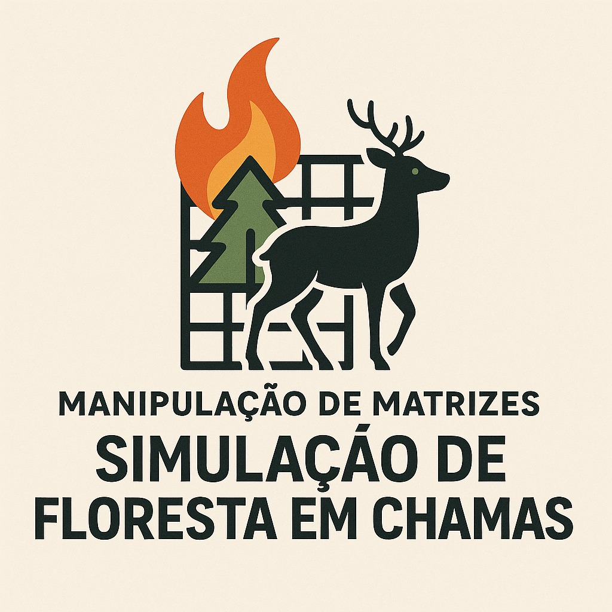

<h1 align="center">
   Simulação de incêndio🔥
</h1>

<div align="center">
  <strong>Simula um incêndio em uma floresta, onde um animal tenta sobreviver enquanto procura por água</strong>
</div>

## 🧽 Índice

* [📘 Introdução](#-introducao)
* [🎯 Objetivos](#-objetivos)
* [🧪 Metodologia](#-metodologia)
* [🛠️ Implementação](#-implementacao)
* [🧬 Estrutura do Projeto](#-estrutura-do-projeto)
* [🚀 Como Executar](#-como-executar)
* [🔥 Análise de Padrões de Propagação do Fogo](#-analise-de-padroes-de-propagacao-do-fogo)
* [🧠 Algoritmos Emergentes para Melhoria](#-algoritmos-emergentes-para-melhoria)
* [📊 Resultados Esperados ao Final da Simulação](#-resultados-esperados-ao-final-da-simulacao)
* [🔚 Conclusão](#-conclusao)
* [💻 Maquina onde foi programado e testado](#-maquina-onde-foi-programado-e-testado)
* [👥 Autores](#-autores)
* [📚 Referências](#-referencias)

---

## 📘 [Introdução]()

Este projeto foi desenvolvido para a disciplina de Algoritmos e Estruturas de Dados I, orientado pelo professor [Michel Pires da Silva](https://github.com/mpiress). O simulador modela a propagação de um incêndio em uma matriz bidimensional que representa uma floresta, considerando o comportamento de um animal que busca rotas seguras e fontes de água para sobreviver.

## 🎯 [Objetivos]()

### Objetivo Geral

Simular a propagação do fogo em uma floresta e a movimentação de um animal tentando sobreviver e encontrar fontes de água.

### Objetivos Específicos

* Modelar a floresta como uma matriz com estados definidos.
* Permitir configuração de parâmetros como vento e iterações.
* Implementar a inteligência de movimentação do animal.
* Registrar a simulação em arquivos de entrada e saída.
* Avaliar desempenho com e sem vento.

## 🧪 [Metodologia]()

A solução foi implementada em C++, utilizando orientação a objetos para modularização das responsabilidades:

* O fogo se propaga de forma ortogonal (e opcionalmente com vento).
* O animal se move com base em prioridades: água > vazio ou árvore > queimado.
* A simulação é iterativa até não restar mais fogo.

O fluxo principal da simulação inicia em  **main.cpp** , que instancia a classe `config` e chama `executarSimulacao()`. A seguir, apresentam-se as etapas-chave da execução, referenciando o arquivo onde cada função está implementada:

### ⚙️ [Classe config](src/config.hpp)

  Principal classe do projeto. Onde é feito as configurações do vento e iterações máximas. Adiciona as classes [Animal](src/Animal.hpp) e [Files](src/Files.hpp) como objetos. Principais funções:

#### 🛠️ [`void executarSimulacao()`](src/config.cpp)

* Função central do programa, a partir dela as outras funções mais importantes serão chamadas
* Chamas a função de leitura do input, a de gravação da matriz - em cada iteração - no output, e a gravação dos dados finais no final do loop
* Chama a função de movimentação do animal, propagação do fogo, apaga o fogo da iteração passada e caso o animal tenha encontrado uma fonte de água, chama a função que dispersa umidade
* Controla o loop principal, que vai até o número máximo de iterações ou não restar mais fogo na matriz
* Imprime na tela o estado da matriz a cada iteração

#### 🔥 [`void propagacaoFogo()`](src/config.cpp)

* Função que chama a função que realmente vai espalhar o fogo(decidi implemtar assim para facilitar a compreensão do código e matê-lo mais limpo e elegante) e controla o vetor que contém as cédulas que serão transformadas em carvão na próxima iteração
* Utilizando 2 for aninhados, verifica cada cédula da matriz procurando pelo valor 2, caso encontre, chama a função de espalhar o fogo e adiciona aquela posição ao vetor que contém as posições que deverão ser apagadas na próxima iteração
* Cria uma cópia da matriz principal que o programe não trate os novos pontos de fogo e espalhe eles na mesma iteração

#### 🌬️🔥 [`vector<vector<short int>> espalharFogo(int posX, int posY, vector<vector<short int>> novaMatriz)`](src/config.cpp)

* Responsável por espalhar o fogo de cada foco, de acordo com a configuração de vento definida no hpp
* Recebe a posição do ponto de fogo que vai espalhar e a cópia da matriz principal
* No [config.hpp](src/config.cpp) há uma matriz já definida com os possíveis tipo de vento que o programa trata. Cada linha da matriz representa um tipo de vento, que é as direções que serão exploradas dentro do for principal. A variável `direcaoVento` defini qual linha dessa matriz será utilizada.
* Dentro do for, é verificado se a casa que será incendiada contem o animal, caso contenha, é dado a segunda chance de escapar para o animal. Se ele não conseguir escapar, verifica se a casa em que ele está é 0, caso afirmativo ele pode ficar 3 iterações parado nela. Se a casa não for 0, siginfica que ele está encurralado pelo fogo e logicamente morreu.
* *Note que não há necessidade de tratar o caso onde o animal fica parado por mais 3 de iterações nesse código, pois um chama dura somente 2 iterações, o animal pode explorar casas já queimadas e como ele está sempre explorando, não irá ocorrer o caso em que quando o fogo o encurralar ele já esteja parado. Esse ponto ficará mais claro na explicação da função de movimentar do animal.

#### 🖨️ [`void imprimirMatriz(vector<vector<T>> &matriz)`](src/config.cpp)

* Função de imprimir as matrizes. Foi trocado os número por emojis para facilitar a visualização no terminal.

  ```
  0 -> 🪨 (Espaço vazio)
  1 -> 🌲 (Árvore)
  2 -> 🔥 (Fogo)
  3 -> ⬛ (Queimada)
  4 -> 💧 (Água)
  9 -> 🐒 (Animal)
  * -> 🐾 (Pegadas)
  ```

### 🐒 [Classe Animal](src/Animal.hpp)

  Classe onde contém a lógica de movimentação do animal. Principais funções:

#### 🍃🐒 [`void movimentar(vector<vector<short int>> &matriz, Files &file, bool acessarVisitados)`](src/Animal.cpp)

* Principal função da classe, controla a movimentação do animal.
* Recebe, por referência, a matriz principal e faz uma cópia dela para a matrizAnimal - para manter os fogos atualizados - recebe o objeto do file - para saber o número de linhas e colunas - e a condição acessarVisitados, usada para quando o animal está sem opção de movimentação, acessar as casas que ele já visitou.
* Explora as casas ortogonais ao animal e guarda o valor e posição dessas casas em dois vetores, que são passados como referência para a função `melhorOpcao`
* Se a função `melhorOpcao` retornar um valor difirente de -1, o animal ira movimentar para a melhor posição. Se retornar -1, siginifica que o animal está cercado por fogo.
* Se na movimentação o animal encontrar água, chama a função de `dispersarUmidade`

#### 🔮 [`short int melhorOpcao(vector<short int> &valorAdjacente, vector<pair<short int, short int>> &posicaoAdjacente, vector<vector<bool>> &visitados, bool acessarVisitados);`](src/Animal.cpp)
* Função que decide qual a melhor a casa para ser explorada
* Recebe como parâmetro os vetores que contém o valor e a posição de cada casa ortogonal a posição atual do animal, a matriz de casas já visitadas e o booleano para saber se pode acessar essas casas.
* Segue a ordem: água > vazio ou árvore > queimado.
* Retorna -1 se o animal está cercado por fogo

#### 💧 [`void dispersarUmidade(short int &x, short int &y, vector<vector<short int>> &matriz, Files &file)`](src/Animal.cpp)

* Caso o animal encontre uma posição que contenha água, valor 4, ele deve dispersar a umidade, tornando as casas ortogonais em 1 e casa em que ele está vira 0.

### 📁 [Classe Files](src/Files.hpp)
  Leitura e gravação dos arquivos [input.dat](arquivos/input.dat) e [output.dat](arquivos/output.dat)
---

## ➕Arquivos adicionais:

### 🐍 [matriz.py](matriz.py)

Feito apenas para facilitar o processo de teste, onde ele gera matrizes de qualquer dimensão para serem testadas. Como não era especificado no trabalho, foi feito em python para facilitar o desenvolvimento.

### 🗂️ [Makefile](Makefile)

Fornecido pelo professor, usado para compilar e executar o projeto.

##### Pré-requisitos

* Linux
* GCC ≥ 11.0
* Make

##### Compilação e Execução

```bash
make clean    # Limpa os arquivos anteriores
make          # Compila o projeto
make run      # Executa a simulação
make all      # Limpa, compila e executa de uma vez só
```

---

## 🧬 [Estrutura do Projeto]()

```text
Trabalho-Aquecimento/
├── src/
│   ├── config.hpp
│   ├── config.cpp
│   ├── Animal.hpp
│   ├── Animal.cpp
│   ├── Files.hpp
│   ├── Files.cpp
│   ├── main.cpp
├── arquivos/
│   ├── input.dat
│   └── output.dat
├── build/          # Gerada automaticamente pelo Makefile
├── assets/         # Pasta contendo imagens e recursos visuais
│   ├── semVento.png
│   └── ventoDireita.png
├── Makefile
├── matriz.py       # Script para geração de matrizes de teste
└── README.md

```

---

## 🔥 [Análise de Padrões de Propagação do Fogo]()

### 🌬️ Influência do Vento na Propagação

A simulação implementada permite analisar dois cenários distintos de propagação de incêndios florestais:

#### Sem Vento (Propagação Ortogonal)


*Figura 1: Propagação uniforme em todas as direções (cima, baixo, esquerda, direita)*

- O fogo se espalha igualmente em todas as 4 direções ortogonais
- Forma padrões aproximadamente circulares/quadrados
- Velocidade de propagação constante em todas as direções
- Áreas queimadas são mais compactas e previsíveis

#### Com Vento (Propagação Direcional)


*Figura 2: Propagação influenciada por vento (neste caso, vento para direita)*

- O fogo se espalha preferencialmente na direção do vento
- Áreas queimadas são mais irregulares

### ⏱️ Previsão do Tamanho do Incêndio

Cada iteração na simulação pode ser interpretada como uma unidade de tempo:

1. **Taxa de Propagação**:

   - Sem vento: de 1 a 4 células/iteração em cada direção
   - Com vento: até 1-3 células/iteração na direção predominante
2. **Fórmula Estimada**:

   ```

   | Tipo de Vento  | Direções Ativas | Fórmula Área    | Crescimento |
   | -------------- | --------------- | --------------- | ----------- |
   | Sem vento      | Todas as 4      | 2t² + 2t + 1    | Quadrático  |
   | Vento único    | 1 direção       | t + 1           | Linear      |
   | Vento em L     | 2 direções      | t²/2 + 3t/2 + 1 | Quadrático  |
   | Vento em leque | 3 direções      | 3t²/4 + 2t + 1  | Quadrático  |

   ```
3. **Fatores Limitantes**:

   - Barreiras naturais (água, áreas já queimadas)
   - Umidade dispersada pelo animal
   - Densidade da vegetação
4. **Previsibilidade**:

   - Cenário sem vento: alta previsibilidade (crescimento quadrático)
   - Cenário com vento: média previsibilidade (depende da direção)

---

## 🧠 [Algoritmos Emergentes para Melhoria]()

### 1. Algoritmo de Dijkstra para Fuga Ótima

**Características**:

- Calcula o caminho mais seguro em tempo real
- Considera distância ao fogo e disponibilidade de água
  **Melhoria**: Aumentaria significativamente as chances de sobrevivência do animal

### 2. Modelo de Percolação para Propagação

**Características**:

- Modela a floresta como uma rede probabilística
- Considera umidade, tipo de vegetação e topografia
  **Melhoria**: Simulação mais realista da propagação do fogo

### 3. Autômatos Celulares com Múltiplos Estados

**Características**:

- Células com estados intermediários (ex: árvore parcialmente queimada)
- Transições de estado baseadas em regras locais
  **Melhoria**: Representação mais granular do processo de queima

### 4. Algoritmos de Aprendizado por Reforço

**Características**:

- Animal "aprende" com experiências anteriores
- Desenvolve estratégias adaptativas de fuga
  **Melhoria**: Comportamento mais inteligente em cenários complexos

### 5. Modelo Baseado em Agentes

**Características**:

- Múltiplos animais interagindo
- Competição por recursos e cooperação
  **Melhoria**: Simulação ecologicamente mais rica

### 📈 Comparação de Desempenho

| Algoritmo           | Complexidade   | Realismo   | Adequação |
| ------------------- | -------------- | ---------- | --------- |
| Atual (Ortogonal)   | O(n²)          | Médio      | Boa       |
| Dijkstra            | O(n log n)     | Alto       | Ótima     |
| Percolação          | O(n³)          | Alto       | Regular   |
| Autômatos Celulares | O(kn²)         | Alto       | Boa       |
| Aprendizado         | O(n²) + treino | Muito Alto | Excelente |

*Tabela 1: Comparação entre abordagens possíveis*

---

## 📊 [Resultados Esperados ao Final da Simulação]()

* Registro detalhado da evolução do fogo a cada iteração.
* Caminho percorrido pelo animal, total de passos e sobrevivência.
* Possível análise de tempo de execução com diferentes condições (vento ou não).

---

## 🔚 [Conclusão]()

A simulação atual oferece uma boa base para entender os padrões fundamentais de propagação de incêndios florestais. A inclusão do vento adiciona um fator realista que altera significativamente a dinâmica do fogo. Para melhorias futuras, a implementação de algoritmos mais sofisticados, particularmente aqueles baseados em autômatos celulares ou aprendizado por reforço, poderia aumentar tanto a precisão quanto o valor educacional da simulação.

---

## 💻 [Maquina onde foi programado e testado]()

* **Sistema operacional:**  Ubuntu 24.04.2 LTS
* **Modelo do hardware:** Lenovo IdeaPad Gaming 3 15IHU6
* **Processador:** 11th Gen Intel® Core™ i5-11300H × 8
* **Memória:** 8,0 GB

---

## 👥 [Autores]()

| Nome                         | Função        | Contato                  |
| ---------------------------- | ------------- | ------------------------ |
| Lucas Roseno Medeiros Araújo | Desenvolvedor | lucasroseno759@gmail.com |

---

## 📚 [Referências]()

* Especificação do trabalho prático da disciplina de AED I, Prof. Michel Pires da Silva (2025)
* cppreference.com (documentação C++)

### Referências dos Algoritmos Emergentes

#### 1. Algoritmo de Dijkstra para Fuga Ótima

- **Referência Primária**:Dijkstra, E. W. (1959). "A note on two problems in connexion with graphs". *Numerische Mathematik*. 1: 269–271.(Artigo seminal que introduziu o algoritmo)
- **Aplicação em Simulações**:
  Koenig, S., & Likhachev, M. (2002). "D* Lite". *AAAI Conference on Artificial Intelligence*.
  (Adaptação para ambientes dinâmicos como incêndios)

#### 2. Modelo de Percolação para Propagação

- **Fundamentos Teóricos**:Stauffer, D., & Aharony, A. (1994). *Introduction to Percolation Theory*. Taylor & Francis.(Livro clássico sobre teoria da percolação)
- **Aplicação em Incêndios**:
  Albini, F. A. (1996). "Iterative Solution of Equations for Spread Modeling". *Combustion Science and Technology*, 113(1), 37-71.

#### 3. Autômatos Celulares

- **Referência Clássica**:Wolfram, S. (2002). *A New Kind of Science*. Wolfram Media.(Capítulos sobre autômatos celulares aplicados a fenômenos naturais)
- **Modelos de Incêndio**:
  Berjak, S. G., & Hearne, J. W. (2002). "An improved cellular automaton model for simulating fire in a spatially heterogeneous Savanna system". *Ecological Modelling*, 148(2), 133-151.

#### 4. Aprendizado por Reforço

- **Fundamentos**:Sutton, R. S., & Barto, A. G. (2018). *Reinforcement Learning: An Introduction*. MIT Press.(Edição atualizada do livro de referência)
- **Aplicação em Sobrevivência**:
  Mnih, V., et al. (2015). "Human-level control through deep reinforcement learning". *Nature*, 518(7540), 529-533.
  (DQN aplicado a problemas de navegação)

#### 5. Modelo Baseado em Agentes

- **Referência Chave**:Gilbert, N. (2008). *Agent-Based Models*. SAGE Publications.(Livro introdutório sobre modelagem baseada em agentes)
- **Ecologia Computacional**:
  Grimm, V., et al. (2006). "A standard protocol for describing individual-based and agent-based models". *Ecological Modelling*, 198(1-2), 115-126.

#### Referências Adicionais para Contexto

- **Simulações de Incêndio Florestal**:Finney, M. A. (1998). "FARSITE: Fire Area Simulator". *USDA Forest Service Technical Report*.
- **Otimização em Ambientes Dinâmicos**:
  LaValle, S. M. (2006). *Planning Algorithms*. Cambridge University Press.
  (Capítulos sobre algoritmos de busca em espaços dinâmicos)
