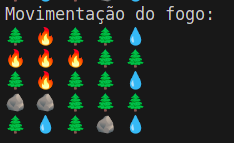
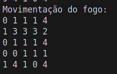

<h1 align="center">
   Simulação de incêndio🔥
</h1>

<div align="center">
  <strong>Simula um incêndio em uma floresta, onde um animal tenta sobreviver enquanto procura por água</strong>
</div>

## 🧽 Índice

* [📘 Introdução](#-introducao)
* [🎯 Objetivos](#-objetivos)
* [🧪 Metodologia](#-metodologia)
* [🛠️ Implementação](#-implementacao)
* [🧬 Estrutura do Projeto](#-estrutura-do-projeto)
* [🚀 Como Executar](#-como-executar)
* [🔥 Análise de Padrões de Propagação do Fogo](#analise-de-padroes-de-propagacao-do-fogo)
* [🧠 Algoritmos Emergentes para Melhoria](#-algoritmos-emergentes-para-melhoria)
* [📊 Resultados Esperados](#resultados-esperados)
* [🔚 Conclusão](#conclusao)
* [📚 Referências](#referencias)
* [👥 Autores](#-autores)

---

## 📘 [Introdução]()

Este projeto foi desenvolvido para a disciplina de Algoritmos e Estruturas de Dados I, orientado pelo professor Michel Pires da Silva. O simulador modela a propagação de um incêndio em uma matriz bidimensional que representa uma floresta, considerando o comportamento de um animal que busca rotas seguras e fontes de água para sobreviver.

## 🎯 [Objetivos]()

### Objetivo Geral

Simular a propagação do fogo em uma floresta e a movimentação de um animal tentando sobreviver e encontrar fontes de água.

### Objetivos Específicos

* Modelar a floresta como uma matriz com estados definidos.
* Permitir configuração de parâmetros como vento e iterações.
* Implementar a inteligência de movimentação do animal.
* Registrar a simulação em arquivos de entrada e saída.
* Avaliar desempenho com e sem vento.

## 🧪 [Metodologia]()

A solução foi implementada em C++, utilizando orientação a objetos para modularização das responsabilidades:

* O fogo se propaga de forma ortogonal (e opcionalmente com vento).
* O animal se move com base em prioridades: água > vazio ou árvore > queimado.
* A simulação é iterativa até não restar mais fogo.

## 🛠️ [Implementação]()

### ⚙️config.hpp/cpp: controle da simulação e propagação do fogo.

#### `executarSimulacao()`

Essa função é o coração da simulação. Ela inicializa a matriz da floresta e a posição do fogo, coordena os ciclos de movimentação do animal e propagação do fogo, e registra os estados a cada iteração até que o fogo se extinga ou o limite máximo de iterações seja atingido.

```cpp

void config::executarSimulacao()
  {
    // Inicializa a matriz a partir do arquivo e define o foco inicial do fogo
    matriz = file.lerMatriz();
    matriz[file.focoX][file.focoY] = 2;
    file.iniciarOutput();

    // Exibe a matriz de entrada
    cout << "\nMatriz de entrada:" << endl;
    imprimirMatriz(matriz);

    // Inicializa o animal na matriz
    animal.inicializador(matriz, file);
    imprimirMatriz(animal.matrizAnimal);

    // Loop principal da simulação
    while (aindaTemFogo() && iteracao < IteracoesMax)
    {
      // Movimenta o animal se ele ainda não morreu
      if (!animal.morreu)
      {
        animal.movimentar(matriz, file, false);
      }

      // Exibe a iteração atual e a movimentação do animal
      cout << "\nITERAÇÃO " << iteracao << ":" << endl;
      cout << "Movimentação do animal: " << endl;
      imprimirMatriz(animal.matrizAnimal);

      // Apaga os fogos da última iteração
      for (const auto &fogo : fogoInicial)
      {
        matriz[fogo.first][fogo.second] = 3;
        file.movimentoFogo(fogo.first, fogo.second, 3, -1, -1);
      }

      // Propaga o fogo para a próxima iteração
      propagacaoFogo();

      // Dispersa umidade se o animal apagou o fogo
      if (animal.apagouFogo)
      {
        dispersarUmidade(animal.posicaoAtual.first, animal.posicaoAtual.second);
      }

      // Exibe a movimentação do fogo
      cout << "Movimentação do fogo: " << endl;
      imprimirMatriz(matriz);

      cout << "====================================" << endl;

      // Incrementa o contador de iterações
      iteracao++;

      // Grava o estado atual da matriz no arquivo
      file.gravarIteracao(iteracao, matriz);
    }

    // Exibe o caminho percorrido pelo animal
    cout << "Caminho percorrido pelo animal: " << endl;
    atualizarMatrizPassos();
    cout << "Total de passos: " << animal.passos << endl;
    cout << "Quantidade de vezes que encontrou água: " << animal.encontrouAgua << endl;

    // Exibe a condição final do animal
    cout << "Condição final do animal: " << (animal.morreu ? "morreu" : "sobreviveu") << endl;
    if (animal.morreu)
    {
      cout << "Iteração em que o animal morreu: " << animal.iteracaoMorte;
    }

    // Grava os dados finais do animal no arquivo
    file.dadosFinaisAnimal(animal.matrizPassos, animal.passos, animal.morreu,
                 animal.iteracaoMorte, animal.encontrouAgua);

    // Fecha o arquivo de saída
    file.fecharOutput();
  }
```

---

#### `propagacaoFogo()`

Responsável por atualizar o estado do fogo na floresta. Essa função varre toda a matriz para encontrar células em chamas (valor `2`) e chama `espalharFogo()` para cada uma delas. Além disso, armazena a posição das células incendiadas para posterior marcação como queimadas (`3`).

```cpp
void config::propagacaoFogo() {
    fogoInicial.clear();                                // Limpa lista de fogos da iteração anterior
    vector<vector<short int>> novaMatriz = matriz;      // Cria cópia da matriz original para atualizar o fogo

    for (int i = 0; i < file.linhas; i++) {
        for (int j = 0; j < file.colunas; j++) {
            if (matriz[i][j] == 2) {                     // Se a célula está em chamas
                novaMatriz = espalharFogo(i, j, novaMatriz); // Espalha o fogo a partir dela
                fogoInicial.push_back(make_pair(i, j));  // Armazena posição da célula em chamas
            }
        }
    }

    matriz = novaMatriz;                                // Atualiza a matriz principal com o novo estado
}
```

---

#### `espalharFogo(int posX, int posY, vector<vector<short int>> novaMatriz)`

Realiza a lógica de propagação do fogo a partir de uma célula específica, levando em conta a direção do vento. Se o animal estiver na área de propagação, é forçado a se mover ou pode morrer. Células com valor `1` (vegetação) se tornam `2` (em chamas) se atingidas.

```cpp
vector<vector<short int>> config::espalharFogo(int posX, int posY, vector<vector<short int>> novaMatriz) {
    // Direções de propagação possíveis para cada tipo de vento (0 = sem vento, 1-14 = direções específicas)
    vector<vector<pair<short int, short int>>> direcoesVento = {
        {{-1, 0}, {1, 0}, {0, -1}, {0, 1}}, // 0: sem vento (ortogonal)
        {{-1, 0}},                          // 1: cima
        {{1, 0}},                           // 2: baixo
        {{0, -1}},                          // 3: esquerda
        {{0, 1}},                           // 4: direita
        {{-1, -1}},                         // 5: cima e esquerda
        {{-1, 1}},                          // 6: cima e direita
        {{1, -1}},                          // 7: baixo e esquerda
        {{1, 1}},                           // 8: baixo e direita
        {{-1, 0}, {0, -1}, {0, 1}},         // 9: cima, esquerda e direita
        {{-1, 0}, {1, 0}, {0, -1}},         // 10: cima, baixo e esquerda
        {{-1, 0}, {1, 0}, {0, 1}},          // 11: cima, baixo e direita
        {{1, 0}, {0, -1}, {0, 1}},          // 12: baixo, esquerda e direita
        {{0, -1}, {0, 1}},                  // 13: esquerda e direita
        {{-1, 0}, {1, 0}}                   // 14: cima e baixo
    };

    for (const auto &dir : direcoesVento[direcaoVento]) {
        short int auxX = posX + dir.first;
        short int auxY = posY + dir.second;

        // Verifica se o animal está na posição que será incendiada
        if (auxX >= 0 && auxX < file.linhas &&
            auxY >= 0 && auxY < file.colunas &&
            animal.matrizAnimal[auxX][auxY] == 9 && animal.valorAnterior == 1) {
  
            // Força o animal a fazer um segundo movimento emergencial
            animal.movimentar(novaMatriz, file, true);

            // Verifica se ele tem para onde fugir
            if (animal.valorI == -1) {
                if (animal.valorAnterior == 0 && animal.tempoParado < 3) {
                    cout << "Como o valor da casa é 0 ele pode ficar parado por 3 iterações" << endl;
                    cout << "Número de iterações parado: " << animal.tempoParado;
                } else {
                    cout << "Não há casas sem fogo ao redor e a casa atual é igual a 1." << endl;
                    cout << "Animal morreu!" << endl;
                    animal.morreu = true;
                    animal.iteracaoMorte = iteracao;
                }
            } else {
                cout << "Fogo atingiu a casa do animal e ele deu o 2 movimento." << endl;
            }

            // Marca a célula com fogo e registra no output
            novaMatriz[auxX][auxY] = 2;
            animal.matrizAnimal[auxX][auxY] = 2;
            file.movimentoFogo(auxX, auxY, 2, dir.first, dir.second);

            imprimirMatriz(animal.matrizAnimal);
            cout << "\n";
        }

        // Caso normal: célula adjacente contém árvore saudável (1)
        if (auxX >= 0 && auxX < file.linhas &&
            auxY >= 0 && auxY < file.colunas &&
            novaMatriz[auxX][auxY] == 1) {
  
            novaMatriz[auxX][auxY] = 2;
            file.movimentoFogo(auxX, auxY, 2, dir.first, dir.second);
        }
    }

    return novaMatriz;
}

```

---

#### `aindaTemFogo()`

Verifica se ainda há fogo na floresta. A simulação continua enquanto essa função retornar `true`.

```cpp
bool config::aindaTemFogo() {
    for (int i = 0; i < file.linhas; i++) {
        for (int j = 0; j < file.colunas; j++) {
            if (matriz[i][j] == 2) {     // Existe célula em chamas
                return true;
            }
        }
    }

    cout << "Não há mais fogo na matriz." << endl;
    return false;
}
```

---

#### `dispersarUmidade(short int &x, short int &y)`

Simula o animal jogando água ao seu redor após apagar o fogo. A célula onde ele está fica vazia (0), e as adjacentes (exceto barreiras) recebem umidade (`1`), dificultando a propagação do fogo.

```cpp
void config::dispersarUmidade(short int &x, short int &y) {
    matriz[x][y] = 0; // Célula onde está o animal fica vazia

    for (size_t i = 0; i < 4; i++) {
        short int posx = x + dx[i];
        short int posy = y + dy[i];

        if (posx >= 0 && posx < file.linhas && posy >= 0 && posy < file.colunas) {
            if (matriz[posx][posy] != 4) { 
                matriz[posx][posy] = 1;    // Define vegetação úmida
            }
        }
    }
}
```

---

#### `imprimirMatriz(vector<vector<short int>> &matriz)`

Função auxiliar que imprime a matriz no terminal, utilizada para depuração.

```cpp
void config::imprimirMatriz(vector<vector<short int>> &matriz) {
    for (const auto &linha : matriz) {
        for (const auto &elemento : linha) {
            cout << elemento << " ";
        }
        cout << "\n";
    }
}
```

---

#### `atualizarMatrizPassos()`

Atualiza e imprime a matriz de passos do animal ao final da simulação. Substitui os valores por caracteres para representar o caminho percorrido.

```cpp
void config::atualizarMatrizPassos() {
    for (short int i = 0; i < file.linhas; i++) {
        for (short int j = 0; j < file.colunas; j++) {
            if (animal.matrizPassos[i][j] != '*' && animal.matrizPassos[i][j] != '9') {
                animal.matrizPassos[i][j] = static_cast<char>(matriz[i][j] + '0');
            }
            cout << animal.matrizPassos[i][j] << " ";
        }
        cout << endl;
    }
}
```

---

### `🐿️ Animal.hpp/cpp`: Lógica de movimentação, busca por água e sobrevivência

#### `inicializador(vector<vector<short int>> &matriz, Files &file)`

Esta função inicializa o estado do animal dentro da matriz da floresta, posicionando-o em uma célula vazia (`0`). Ela também define as estruturas de dados para o rastreamento de passos e células visitadas, marcando a posição inicial do animal e a inserindo na matriz com o valor `9` para indicar sua presença.

```cpp
void Animal::inicializador(vector<vector<short int>> &matriz, Files &file)
{
    visitados.resize(file.linhas, vector<bool>(file.colunas, false));  // Cria a matriz de visitados, inicializada como falsa
    matrizPassos.resize(file.linhas, vector<char>(file.colunas));      // Cria a matriz de passos para o animal

    matrizAnimal = matriz;  // A matriz original é copiada para o estado do animal

    // Procura por uma célula vazia (valor 0) para posicionar o animal
    for (short int i = 0; i < file.linhas; i++)
    {
        for (short int j = 0; j < file.colunas; j++)
        {
            matrizPassos[i][j] = static_cast<char>(matriz[i][j] + '0');  // Copia o valor da matriz original para a matriz de passos

            if (matriz[i][j] == 0 && posicaoAtual.first == -1)  // Se encontrar uma célula vazia e o animal ainda não tiver sido posicionado
            {
                posicaoAtual = make_pair(i, j);  // Define a posição inicial do animal
                matrizAnimal[i][j] = 9;  // Marca o animal na matriz com valor 9
                matrizPassos[i][j] = '9';  // Atualiza a matriz de passos
                visitados[i][j] = true;  // Marca a célula como visitada
                cout << "\nPosição do animal: " << posicaoAtual.first << ", "
                     << posicaoAtual.second << endl;
            }
        }
    }
}
```

---

#### `movimentar(vector<vector<short int>> &matriz, Files &file, bool acessarVisitados)`

Essa função é responsável pelo movimento do animal. Ela calcula os valores das células adjacentes, escolhe a melhor célula para o animal se mover com base em um critério (preferência por água, depois por áreas vazias ou árvores, e por último áreas queimadas), e então move o animal para a célula selecionada.

Observe que não é necessário tratar a situação em que o tempo parado do animal desja maior que 3, visto que ele só ficará parado se estiver encurralado pelo fogo e a cédula em que está seja 0 (se for 1, ele morre), e levando em consideração que uma árvore gasta duas iterações para ser queimada e virar 3, a situação em que o animal fica mais de 3 iterações parado não acontece nessa implementação.

```cpp
void Animal::movimentar(vector<vector<short int>> &matriz, Files &file, bool acessarVisitados)
{
    matrizAnimal = matriz;  // Atualiza a matriz com a posição atual do animal
    matrizAnimal[posicaoAtual.first][posicaoAtual.second] = 9;  // Marca a célula atual como ocupada pelo animal

    apagouFogo = false;  // Reseta o estado de se o animal apagou fogo

    valorAdjacente.clear();  // Limpa os valores adjacentes
    posicaoAdjacente.clear();  // Limpa as posições adjacentes

    short int posx = -1;
    short int posy = -1;

    // Verifica as 4 direções ao redor do animal
    for (size_t i = 0; i < 4; i++)
    {
        posx = posicaoAtual.first + dx[i];  // Calcula a posição adjacente
        posy = posicaoAtual.second + dy[i];

        // Se a posição adjacente for válida, armazena os valores e posições
        if (posx >= 0 && posx < file.linhas && posy >= 0 && posy < file.colunas)
        {
            valorAdjacente.push_back(matrizAnimal[posx][posy]);
            posicaoAdjacente.push_back(pair(posx, posy));
        }
    }

    valorI = melhorOpcao(valorAdjacente, posicaoAdjacente, visitados, acessarVisitados);  // Determina a melhor opção de movimento

    if (valorI != -1)
    {
        posx = posicaoAdjacente[valorI].first;
        posy = posicaoAdjacente[valorI].second;

        // Atualiza a matriz e a posição do animal
        matrizAnimal[posicaoAtual.first][posicaoAtual.second] = valorAnterior;
        matrizAnimal[posx][posy] = 9;

        visitados[posicaoAtual.first][posicaoAtual.second] = true;

        // Atualiza a matriz de passos
        matrizPassos[posicaoAtual.first][posicaoAtual.second] = '*';
        matrizPassos[posx][posy] = '9';

        passos++;  // Incrementa o número de passos do animal
        tempoParado = 0;  // Reseta o tempo parado

        valorAnterior = valorAdjacente[valorI];  // Atualiza o valor da célula anterior

        // Se o animal encontrou água, dispersa umidade
        if (valorAnterior == 4)
        {
            dispersarUmidade(posx, posy, matrizAnimal, file);
            apagouFogo = true;  // Marca que o animal apagou fogo
            encontrouAgua++;  // Conta o número de vezes que o animal encontrou água
        }

        posicaoAtual = pair(posx, posy);  // Atualiza a posição do animal
    }
    else
    {
        tempoParado++;  // Incrementa o tempo parado caso não haja movimento
    }
}
```

---

#### `melhorOpcao(vector<short int> &valorAdjacente, vector<pair<short int, short int>> &posicaoAdjacente, vector<vector<bool>> &visitados, bool acessarVisitados)`

Essa função avalia as opções de movimento disponíveis, priorizando a água (`4`), depois espaços vazios (`0`) ou árvores (`1`), e por último áreas queimadas (`3`). Se nenhuma célula válida for encontrada, retorna `-1`.

```cpp
short int Animal::melhorOpcao(vector<short int> &valorAdjacente,
                              vector<pair<short int, short int>> &posicaoAdjacente, vector<vector<bool>> &visitados,
                              bool acessarVisitados)
{
    short int posicao1ou0 = -1;
    short int posicao3 = -1;

    // Avalia as opções de movimento
    for (size_t i = 0; i < valorAdjacente.size(); i++)
    {
        short int x = posicaoAdjacente[i].first;
        short int y = posicaoAdjacente[i].second;

        // Prioriza a água
        if (valorAdjacente[i] == 4)
        {
            return i;
        }
        // Se for vazio ou árvore e o animal não visitou a célula, prioriza
        else if ((valorAdjacente[i] == 1 || valorAdjacente[i] == 0) &&
                 (acessarVisitados || !visitados[x][y]) && posicao1ou0 == -1)
        {
            posicao1ou0 = i;
        }
        // Se for queimado e o animal não visitou a célula, prioriza
        else if (valorAdjacente[i] == 3 &&
                 (acessarVisitados || !visitados[x][y]) && posicao3 == -1)
        {
            posicao3 = i;
        }
    }

    // Se houver uma posição válida, retorna a posição
    if (posicao1ou0 != -1)
    {
        return posicao1ou0;
    }
    if (posicao3 != -1)
    {
        return posicao3;
    }

    return -1;  // Se nenhuma célula válida for encontrada, retorna -1
}
```

---

#### `dispersarUmidade(short int &x, short int &y, vector<vector<short int>> &matriz, Files &file)`

Esta função simula o ato de o animal dispersar umidade ao seu redor, apagando o fogo nas células adjacentes (exceto barreiras) e tornando-as mais resistentes à propagação de fogo.

```cpp
void Animal::dispersarUmidade(short int &x, short int &y, vector<vector<short int>> &matriz,
                              Files &file)
{
    valorAnterior = 0;  // Define que a célula onde o animal está será vazia

    // Dispersa umidade nas 4 células adjacentes
    for (size_t i = 0; i < 4; i++)
    {
        short int posx = x + dx[i];
        short int posy = y + dy[i];

        // Se a célula for válida, aplica a umidade (transforma em vegetação saudável)
        if (posx >= 0 && posx < file.linhas && posy >= 0 && posy < file.colunas)
        {
            if (matriz[posx][posy] != 4)  // Não aplica umidade em água
            {
                matriz[posx][posy] = 1;  // Marca como vegetação saudável (umidade)
            }
        }
    }
}
```

### 📁Files.hpp/.cpp: Leitura e Gravação de Dados

---

#### `lerMatriz()`

Lê a configuração inicial da floresta (dimensões e foco de fogo) e o estado de cada célula a partir de `src/input.dat`.

```cpp
vector<vector<short int>> Files::lerMatriz()
{
    try
    {
        ifstream arquivoEntrada("src/input.dat");                // Abre o arquivo de entrada
        if (!arquivoEntrada)
        {
            throw runtime_error("Arquivo não encontrado");       // Exceção se o arquivo não estiver disponível
        }

        string linha;
        if (getline(arquivoEntrada, linha))                        // Lê a primeira linha com dimensões e foco
        {
            stringstream ss(linha);                                // Stream para extrair valores

            ss >> linhas >> colunas >> focoX >> focoY;            // Define linhas, colunas e posição inicial do fogo

            if (linhas <= 0 || colunas <= 0)
            {
                throw runtime_error("Dimensões da matriz inválidas."); // Verificação de integridade
            }

            // Inicializa a matriz com as dimensões lidas
            vector<vector<short int>> matriz(linhas, vector<short int>(colunas));

            // Preenche cada célula com o valor lido do arquivo
            for (int i = 0; i < linhas; i++)
            {
                for (int j = 0; j < colunas; j++)
                {
                    arquivoEntrada >> matriz[i][j];                 // Lê o estado da célula (0,1,...) e armazena
                }
            }
            return matriz;                                          // Retorna a matriz completa
        }
    }
    catch (const exception &e)
    {
        cout << e.what() << endl;                                 // Exibe mensagem de erro no console
    }
    return vector<vector<short int>>();                         // Retorna matriz vazia em caso de falha
}
```

---

#### `iniciarOutput()`

Abre o arquivo de saída `src/output.dat` e escreve o cabeçalho inicial.

```cpp
void Files::iniciarOutput() {
    arquivoSaida.open("src/output.dat");                       // Cria/abre o arquivo de saída
    if (!arquivoSaida) {
        cerr << "Erro ao criar arquivo de saída!" << endl;     // Erro se não conseguir abrir
        return;
    }
    arquivoSaida << "RESULTADO DA SIMULAÇÃO: \n\n";          // Cabeçalho para o relatório
}
```

---

#### `gravarIteracao(int &iteracao, vector<vector<short int>> &matrizFogo)`

Registra no arquivo de saída o estado completo da floresta na iteração atual.

```cpp
void Files::gravarIteracao(int &iteracao, vector<vector<short int>> &matrizFogo) {
    if (!arquivoSaida.is_open()) {
        cerr << "Erro: arquivo de saída não está aberto!" << endl;
        return;                                                  // Garante que o arquivo esteja aberto
    }

    arquivoSaida << "Iteração: " << iteracao << endl;         // Cabeçalho da iteração

    // Imprime toda a matriz linha por linha
    for (short int i = 0; i < linhas; i++) {
        for (short int j = 0; j < colunas; j++) {
            arquivoSaida << matrizFogo[i][j] << " ";            // Valor de cada célula
        }
        arquivoSaida << endl;
    }

    arquivoSaida << endl;                                       // Linha em branco entre iterações
}
```

---

#### `movimentoFogo(short int x, short int y, short int valor, short int dx, short int dy)`

Anota no relatório cada célula que mudou para chamas, incluindo direção de propagação.

```cpp
void Files::movimentoFogo(short int x, short int y, short int valor, short int dx, short int dy){  
    arquivoSaida << "- (" << x << ", " << y << ") vira " << valor; // Posição e novo estado
    string msg = definirDirecao(dx, dy);                             // Obtém descrição da direção
    if (msg != "")
    {
        arquivoSaida << " (" << msg << ")";                      // Anexa a direção, se válida
    }
    arquivoSaida << endl;
}
```

---

#### `definirDirecao(short int &dx, short int &dy)`

Retorna uma string representando a direção do movimento com base nos deslocamentos `dx` e `dy`.

```cpp
string Files::definirDirecao(short int &dx, short int &dy){
    if (dx == -1 && dy == 0)      return "acima";                // Movimento para cima
    else if (dx == 1 && dy == 0)  return "abaixo";               // Movimento para baixo
    else if (dx == 0 && dy == -1) return "esquerda";             // Movimento para esquerda
    else if (dx == 0 && dy == 1)  return "direita";              // Movimento para direita
    else if (dx == -1 && dy == -1) return "";                    // Caso diagonal ignorado
    return "direção inválida";                                   // Qualquer outro caso
}
```

---

#### `fecharOutput()`

Fecha o fluxo de saída, garantindo que o arquivo seja encerrado corretamente.

```cpp
void Files::fecharOutput() {
    if (arquivoSaida.is_open()) {
        arquivoSaida.close();                                     // Fecha o arquivo, liberando recursos
    }
}
```

---

#### `dadosFinaisAnimal(vector<vector<char>> &matrizPassos, short int passos, bool morreu, short int iteracaoMorte, short int encontrouAgua)`

Escreve os resultados finais da travessia do animal: caminho, passos, encontros com água e condição.

```cpp
void Files::dadosFinaisAnimal(vector<vector<char>> &matrizPassos, short int passos,
    bool morreu, short int iteracaoMorte, short int encontrouAgua){
    arquivoSaida << "DADOS FINAIS: " << endl;
    arquivoSaida << "Caminho percorrido pelo animal: " << endl;

    // Desenha a matriz de passos com caracteres
    for (short int i = 0; i < linhas; i++) {
        for (short int j = 0; j < colunas; j++) {
            arquivoSaida << matrizPassos[i][j] << " ";
        }
        arquivoSaida << endl;
    }
  
    arquivoSaida << "Total de passos: " << passos << endl;             // Total de movimentos
    arquivoSaida << "Quantidade de vezes que encontrou água: " << encontrouAgua << endl;

    arquivoSaida << "Condição final do animal: " << (morreu ? "morreu" : "sobreviveu") << endl;
    if (morreu)
    {
        arquivoSaida << "Iteração em que o animal morreu: " << iteracaoMorte;
    }
}  
```

---

### 👑main.cpp: Chamada do código

A única função do main é chamada da função principal do código:

```cpp
#include "config.hpp"
#include "Files.hpp"
#include <vector>

int main (){
    config floresta;
    floresta.executarSimulacao();
}
```

---

## ➕Arquivos adicionais:

### 🐍 matriz.py

Feito apenas para facilitar o processo de teste, onde ele gera matrizes de qualquer dimensão para serem testadas. Como não era especificado no trabalho, foi feito em python para facilitar o desenvolvimento.

```python
import random

def gerar_matriz(linhas, colunas):
    return [[random.choices([0, 1, 4], weights=[1, 3, 0.1])[0] for _ in range(colunas)] for _ in range(linhas)]

def salvar_matriz_em_arquivo(matriz, arquivo):
    with open(arquivo, "w") as f:
        f.write(f"{len(matriz)} {len(matriz[0])} 1 1\n")  
        for linha in matriz:
            f.write(" ".join(map(str, linha)) + "\n")

if __name__ == "__main__":
    linhas = int(input("Digite o número de linhas: "))
    colunas = int(input("Digite o número de colunas: "))
    matriz = gerar_matriz(linhas, colunas)
    salvar_matriz_em_arquivo(matriz, "src/input.dat")
    print("\nMatriz salva no arquivo 'input.dat'.")

```

### 🗂️MakeFile

Fornecido pelo professor, sofreu apenas uma leve moderação para rodar no projeto:

```makefile
BUILD     := build
OBJ_DIR   := $(BUILD)/objects
APP_DIR   := $(BUILD)
TARGET    := app
INCLUDE   := -Iinclude/
SRC       := $(wildcard src/*.cpp)
OBJECTS   := $(patsubst src/%.cpp,$(OBJ_DIR)/%.o,$(SRC))

CXX       := g++
CXXFLAGS  := -Wall -Wextra -Werror
LDFLAGS   := -lm

all: clean $(APP_DIR)/$(TARGET)
	@clear
	@echo "Executando $(APP_DIR)/$(TARGET)..."
	@./$(APP_DIR)/$(TARGET)

$(OBJ_DIR)/%.o: src/%.cpp
	@mkdir -p $(dir $@)
	@$(CXX) $(CXXFLAGS) $(INCLUDE) -c $< -o $@

$(APP_DIR)/$(TARGET): $(OBJECTS)
	@mkdir -p $(dir $@)
	@$(CXX) $(OBJECTS) -o $@ $(LDFLAGS)
	@chmod +x $@

clean:
	@rm -rf $(BUILD)

run: $(APP_DIR)/$(TARGET)
	@clear
	@./$(APP_DIR)/$(TARGET)

.PHONY: all clean run

```

---

## 🧬 [Estrutura do Projeto]()

```text
Trabalho-Aquecimento/
├── src/
│   ├── config.hpp
│   ├── config.cpp
│   ├── Animal.hpp
│   ├── Animal.cpp
│   ├── Files.hpp
│   ├── Files.cpp
│   ├── main.cpp
│   ├── input.dat
│   └── output.dat
├── build/          # Gerada automaticamente pelo Makefile
├── assets/         # Pasta contendo imagens e recursos visuais
│   ├── semVento.png
│   └── ventoDireita.png
├── Makefile
├── matriz.py       # Script para geração de matrizes de teste
└── README.md
```

---

## 🚀 [Como Executar]()

### Pré-requisitos

* Linux
* GCC ≥ 9.0
* Make

### Compilação e Execução

```bash
make clean    # Limpa os arquivos anteriores
make          # Compila o projeto
make run      # Executa a simulação
```

---

## 🔥 Análise de Padrões de Propagação do Fogo <a name="analise-de-padroes-de-propagacao-do-fogo"></a>

### 🌬️ Influência do Vento na Propagação

A simulação implementada permite analisar dois cenários distintos de propagação de incêndios florestais:

#### Sem Vento (Propagação Ortogonal)


*Figura 1: Propagação uniforme em todas as direções (cima, baixo, esquerda, direita)*

- O fogo se espalha igualmente em todas as 4 direções ortogonais
- Forma padrões aproximadamente circulares/quadrados
- Velocidade de propagação constante em todas as direções
- Áreas queimadas são mais compactas e previsíveis

#### Com Vento (Propagação Direcional)



*Figura 2: Propagação influenciada por vento (neste caso, vento para direita)*

- O fogo se espalha preferencialmente na direção do vento
- Áreas queimadas são mais irregulares e extensas

### ⏱️ Previsão do Tamanho do Incêndio

Cada iteração na simulação pode ser interpretada como uma unidade de tempo:

1. **Taxa de Propagação**:

   - Sem vento: de 1 a 4 células/iteração em cada direção
   - Com vento: até 1-3 células/iteração na direção predominante
2. **Fórmula Estimada**:

   ```

   | Tipo de Vento        | Direções Ativas     | Fórmula Área       | Crescimento |
   |----------------------|---------------------|--------------------|-------------|
   | Sem vento            | Todas as 4          | 2t² + 2t + 1       | Quadrático  |
   | Vento único          | 1 direção           | t + 1              | Linear      |
   | Vento em L           | 2 direções          | t²/2 + 3t/2 + 1    | Quadrático  |
   | Vento em leque       | 3 direções          | 3t²/4 + 2t + 1     | Quadrático  |

   ```
3. **Fatores Limitantes**:

   - Barreiras naturais (água, áreas já queimadas)
   - Umidade dispersada pelo animal
   - Densidade da vegetação
4. **Previsibilidade**:

   - Cenário sem vento: alta previsibilidade (crescimento quadrático)
   - Cenário com vento: média previsibilidade (depende da direção)

---

## 🧠 [Algoritmos Emergentes para Melhoria]()

### 1. Algoritmo de Dijkstra para Fuga Ótima

**Características**:

- Calcula o caminho mais seguro em tempo real
- Considera distância ao fogo e disponibilidade de água
  **Melhoria**: Aumentaria significativamente as chances de sobrevivência do animal

### 2. Modelo de Percolação para Propagação

**Características**:

- Modela a floresta como uma rede probabilística
- Considera umidade, tipo de vegetação e topografia
  **Melhoria**: Simulação mais realista da propagação do fogo

### 3. Autômatos Celulares com Múltiplos Estados

**Características**:

- Células com estados intermediários (ex: árvore parcialmente queimada)
- Transições de estado baseadas em regras locais
  **Melhoria**: Representação mais granular do processo de queima

### 4. Algoritmos de Aprendizado por Reforço

**Características**:

- Animal "aprende" com experiências anteriores
- Desenvolve estratégias adaptativas de fuga
  **Melhoria**: Comportamento mais inteligente em cenários complexos

### 5. Modelo Baseado em Agentes

**Características**:

- Múltiplos animais interagindo
- Competição por recursos e cooperação
  **Melhoria**: Simulação ecologicamente mais rica

### 📈 Comparação de Desempenho

| Algoritmo            | Complexidade    | Realismo   | Adequação |
| -------------------- | --------------- | ---------- | ----------- |
| Atual (Ortogonal)    | O(n²)          | Médio     | Boa         |
| Dijkstra             | O(n log n)      | Alto       | Ótima      |
| Percolação         | O(n³)          | Alto       | Regular     |
| Autômatos Celulares | O(kn²)         | Alto       | Boa         |
| Aprendizado          | O(n²) + treino | Muito Alto | Excelente   |

*Tabela 1: Comparação entre abordagens possíveis*

---

## 📊 [Resultados Esperados ao Final da Simulação]()

* Registro detalhado da evolução do fogo a cada iteração.
* Caminho percorrido pelo animal, total de passos e sobrevivência.
* Possível análise de tempo de execução com diferentes condições (vento ou não).

---

## 🔚 [Conclusão]()

A simulação atual oferece uma boa base para entender os padrões fundamentais de propagação de incêndios florestais. A inclusão do vento adiciona um fator realista que altera significativamente a dinâmica do fogo. Para melhorias futuras, a implementação de algoritmos mais sofisticados, particularmente aqueles baseados em autômatos celulares ou aprendizado por reforço, poderia aumentar tanto a precisão quanto o valor educacional da simulação.

---


## 💻 [Maquina onde foi programado e testado]()

* **Sistema operacional:**  Ubuntu 24.04.2 LTS
* **Modelo do hardware:** Lenovo IdeaPad Gaming 3 15IHU6
* **Processador:** 11th Gen Intel® Core™ i5-11300H × 8
* **Memória:** 8,0 GB

---

## 📚 [Referências]()

* Especificação do trabalho prático da disciplina de AED I, Prof. Michel Pires da Silva (2025)
* cppreference.com (documentação C++)

### Referências dos Algoritmos Emergentes

#### 1. Algoritmo de Dijkstra para Fuga Ótima

- **Referência Primária**:Dijkstra, E. W. (1959). "A note on two problems in connexion with graphs". *Numerische Mathematik*. 1: 269–271.(Artigo seminal que introduziu o algoritmo)
- **Aplicação em Simulações**:
  Koenig, S., & Likhachev, M. (2002). "D* Lite". *AAAI Conference on Artificial Intelligence*.
  (Adaptação para ambientes dinâmicos como incêndios)

#### 2. Modelo de Percolação para Propagação

- **Fundamentos Teóricos**:Stauffer, D., & Aharony, A. (1994). *Introduction to Percolation Theory*. Taylor & Francis.(Livro clássico sobre teoria da percolação)
- **Aplicação em Incêndios**:
  Albini, F. A. (1996). "Iterative Solution of Equations for Spread Modeling". *Combustion Science and Technology*, 113(1), 37-71.

#### 3. Autômatos Celulares

- **Referência Clássica**:Wolfram, S. (2002). *A New Kind of Science*. Wolfram Media.(Capítulos sobre autômatos celulares aplicados a fenômenos naturais)
- **Modelos de Incêndio**:
  Berjak, S. G., & Hearne, J. W. (2002). "An improved cellular automaton model for simulating fire in a spatially heterogeneous Savanna system". *Ecological Modelling*, 148(2), 133-151.

#### 4. Aprendizado por Reforço

- **Fundamentos**:Sutton, R. S., & Barto, A. G. (2018). *Reinforcement Learning: An Introduction*. MIT Press.(Edição atualizada do livro de referência)
- **Aplicação em Sobrevivência**:
  Mnih, V., et al. (2015). "Human-level control through deep reinforcement learning". *Nature*, 518(7540), 529-533.
  (DQN aplicado a problemas de navegação)

#### 5. Modelo Baseado em Agentes

- **Referência Chave**:Gilbert, N. (2008). *Agent-Based Models*. SAGE Publications.(Livro introdutório sobre modelagem baseada em agentes)
- **Ecologia Computacional**:
  Grimm, V., et al. (2006). "A standard protocol for describing individual-based and agent-based models". *Ecological Modelling*, 198(1-2), 115-126.

#### Referências Adicionais para Contexto

- **Simulações de Incêndio Florestal**:Finney, M. A. (1998). "FARSITE: Fire Area Simulator". *USDA Forest Service Technical Report*.
- **Otimização em Ambientes Dinâmicos**:
  LaValle, S. M. (2006). *Planning Algorithms*. Cambridge University Press.
  (Capítulos sobre algoritmos de busca em espaços dinâmicos)

---

## 👥 [Autores]()

| Nome                          | Função      | Contato                  |
| ----------------------------- | ------------- | ------------------------ |
| Lucas Roseno Medeiros Araújo | Desenvolvedor | lucasroseno759@gmail.com |
