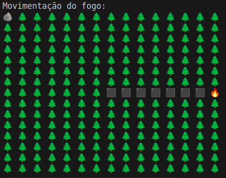
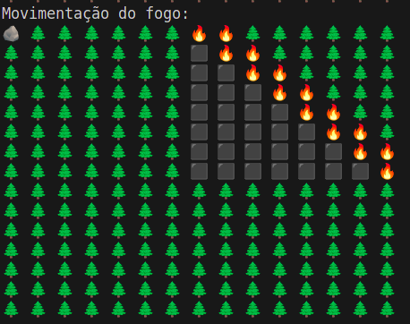
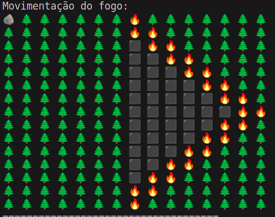

## Teste 4: vento em uma direção

Arquivos: [inTeste4.dat](../arquivos/inTeste4.dat), [outTeste4.dat](../arquivos/outTeste4.dat)

O fogo se propaga em linha reta em apenas uma direção(nesse caro, direita). Pode se afirmar que o animal sobrevive.

## Teste 5: vento em duas direções

Arquivos: [inTeste5.dat](../arquivos/inTeste5.dat), [outTeste5.dat](../arquivos/outTeste5.dat)

Forma um padrão de área queimada retangular, e o fogo se espalha na forma de uma diagonal do foco até o limite da matriz. Se o animal estiver fora do retângulo formado pela linha e coluna do foco incial, há grandes chances de sobrevivência. Ventos: direita e cima

## Teste 6: vento em três direções

Arquivos: [inTeste6.dat](../arquivos/inTeste6.dat), [outTeste6.dat](../arquivos/outTeste6.dat)

Fogo se espalha em formato triangular e o padrão de área queimada é retangular. Se a posição incial do animal for fora desse retângulo, também a grandes chances de sobreviver. Vento: cima, direita e baixo.

*Nota: com obstáculo para o fogo seguiria os mesmo padrões dos teste anteriores, mas as formas ficariam um pouco diferente.
