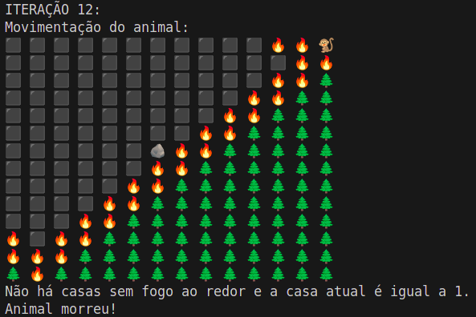
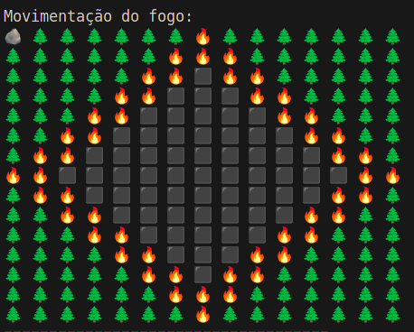
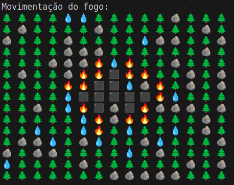

## Teste 1 - fogo começa na ponta e animal no meio:

Configurações da matriz:
Arquivos: [inTeste1.dat](../arquivos/inTeste1.dat), [outTeste1.dat](../arquivos/outTeste1.dat)

Nesse caso, nota-se que o fogo se espalha como se fosse uma linha diagonal pela matriz, e na maioria das posições que o animal começar, ira cercá-lo.

## Teste 2 - fogo começa no meio e animal na ponta

Arquivos: [inTeste2.dat](../arquivos/inTeste2.dat), [outTeste2.dat](../arquivos/outTeste2.dat)

Fogo se espalha rapidamente em um padrão geométrico de um losangu. Também tem grandes chances de encurralar o animal.

## Teste 3: vários obstáculos para o fogo no caminho

Arquivos: [inTeste3.dat](../arquivos/inTeste3.dat), [outTeste3.dat](../arquivos/outTeste3.dat)

O fogo continua tentando seguir as formas geométricas dos casos anteriores(nesse caso, como o fogo começou no meio, de um losango), porém quanto mais obstáculos, menos parecido fica, o animal tem mais chances de sobreviver e de árvores ficarem intactas.
